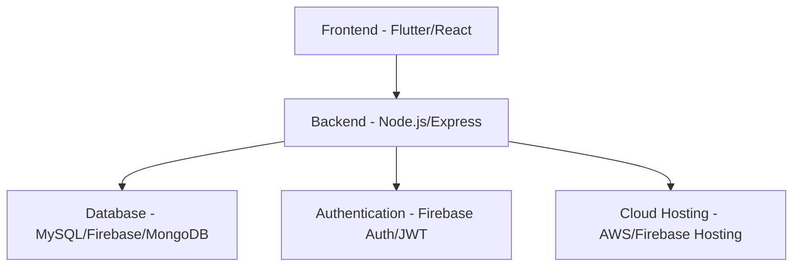

# 🎓 EduPro – Smart Learning Platform  
> _A Smart Course Discovery and Learning Management Application_


---

## 🌟 Introduction

**EduPro** is an intelligent learning platform designed to simplify the way learners and educators interact.  
It offers a seamless experience for discovering, enrolling, and managing online courses across multiple domains.

EduPro aims to **empower learners** with the right tools and **enable educators** to share knowledge efficiently — all under one digital ecosystem.

---

## 🖼️ UI Mockups & Screens

> 🧠 _Modern Gradient UI with Purple tones for an elegant and futuristic look._

| Screen | Preview |
|:-------|:--------:|
| Splash & Onboarding |   |
| Login / Sign Up |   |
| Home Dashboard |  |
| Course Details |  |
| Enrolled Courses |  |
| Profile & Settings |  |

> 💡 Add real screenshots or Figma links here to give your repository a **visual appeal**.  
> For example:  
> `[View Full UI in Figma](https://www.figma.com/file/your-figma-project-link)`

---

## 🎯 Objectives

- ✅ Develop a **multi-role learning platform** for students, faculty, and admins.  
- 🔒 Provide **secure authentication** and role-based dashboards.  
- 🔍 Implement **smart search and course filters**.  
- 📊 Allow learners to **track their course progress**.  
- 💾 Maintain a **centralized, scalable database**.  
- 🤖 Integrate **AI-powered recommendations** (future enhancement).  

---

## 🚀 Key Features

### 👩‍🎓 Students
- Register and log in securely.  
- Explore and search courses by category, difficulty, or instructor.  
- Enroll in courses and track progress.  
- Download completion certificates.

### 👨‍🏫 Faculty
- Add and manage courses.  
- Upload study materials and assessments.  
- View analytics on student participation.

### 🧑‍💼 Admin
- Manage all users and courses.  
- Approve or remove courses.  
- Generate reports and platform analytics.

---

## 🏗️ System Architecture



**Data Flow:**
1. User logs in securely (Firebase Auth / JWT).  
2. Backend verifies credentials and retrieves role-based dashboard.  
3. Students browse, enroll, and track progress.  
4. Data updates are stored in real-time via database sync.

---

## 🧠 Technology Stack

| Component | Technology |
|------------|-------------|
| **Frontend** | Flutter / React |
| **Backend** | Node.js (Express) |
| **Database** | MySQL / Firebase |
| **Authentication** | Firebase Auth / JWT |
| **Cloud Storage** | AWS S3 / Firebase Storage |
| **Testing** | Postman |
| **Version Control** | Git & GitHub |

---

## 📅 Project Timeline

| Phase | Duration | Key Deliverables |
|--------|-----------|------------------|
| Phase 1 | Week 1–2 | Requirement Gathering & UI Design |
| Phase 2 | Week 3–5 | Backend API & Database Setup |
| Phase 3 | Week 6–8 | Frontend Integration |
| Phase 4 | Week 9–10 | Testing & Debugging |
| Phase 5 | Week 11 | Deployment & Documentation |

---

## 🌈 UI Design Concept

🎨 **Theme:** Modern Gradient (Purple tones)  
📱 **Design Language:** Minimalist, clean typography, rounded UI components  
🧩 **Core Screens:**  
- Splash & Onboarding  
- Login / Signup  
- Dashboard  
- Course Details  
- My Courses  
- Profile & Settings  

---

## 🔮 Future Enhancements

- 🤖 AI-based personalized course recommendation  
- 💬 Live classes and chat integration  
- 💳 Payment gateway for premium content  
- 🪙 Certificate verification via blockchain  

---

## ⚙️ Installation & Setup

```bash
# Clone the repository
git clone https://github.com/your-username/EduPro.git

# Navigate to project directory
cd EduPro

# Install dependencies
npm install

# Start the development server
npm start
```

---

## 🧾 Expected Outcomes

- Seamless multi-role education platform  
- Simplified course discovery and progress tracking  
- Centralized, secure, and scalable data management  
- AI-ready architecture for future expansion  

---

## 🏁 Conclusion

EduPro is built to **redefine the digital learning experience**.  
It combines technology, interactivity, and smart features to help learners and educators stay connected in a modern educational environment.

> “Learning made simple, smart, and scalable.”

---

## 📬 Contact

**👤 Project Maintainer:** Avinash  
📧 Email: [your-email@example.com]  
🌐 LinkedIn: [linkedin.com/in/your-profile](https://linkedin.com/in/your-profile)  
💻 GitHub: [github.com/your-username](https://github.com/your-username)